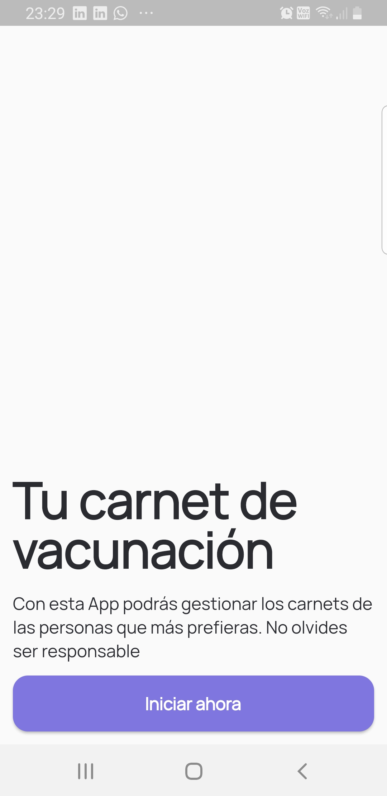
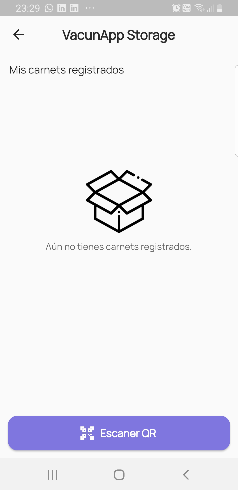
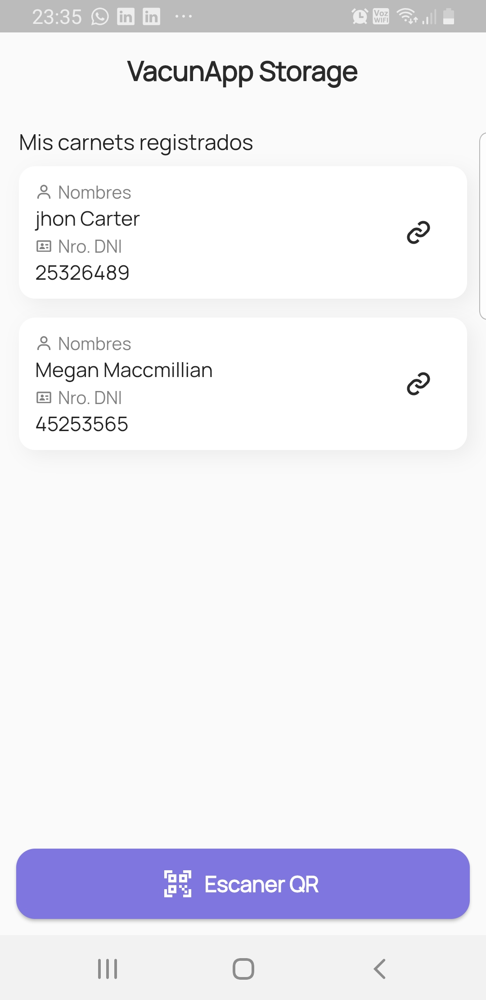
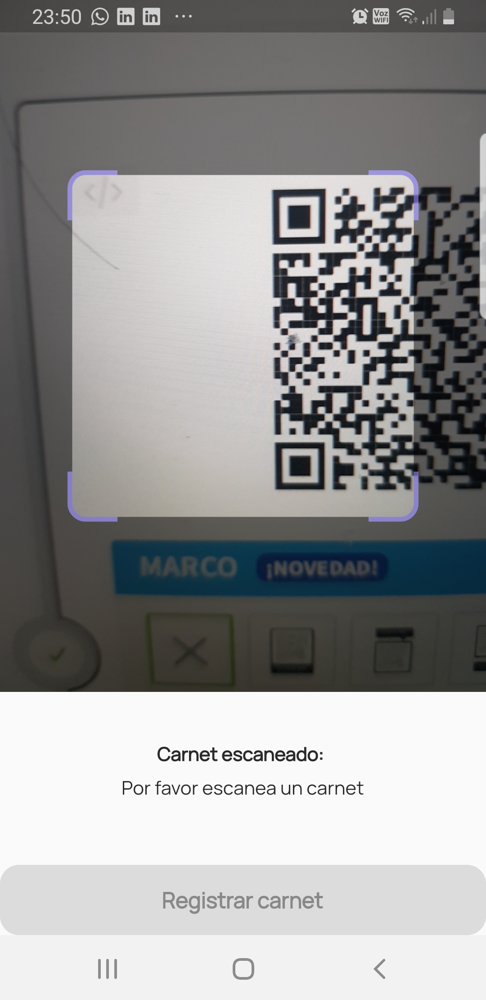
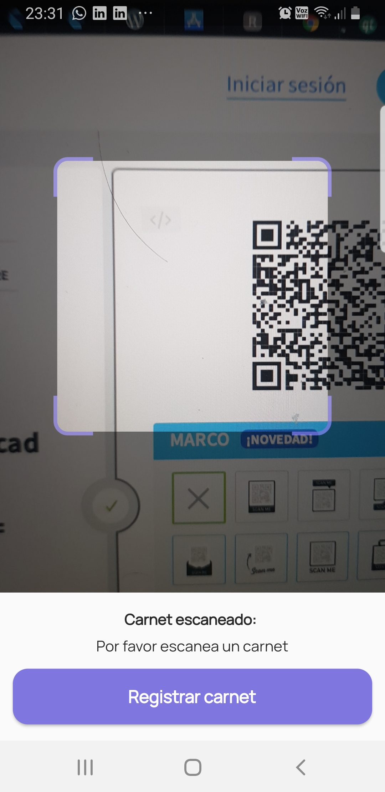
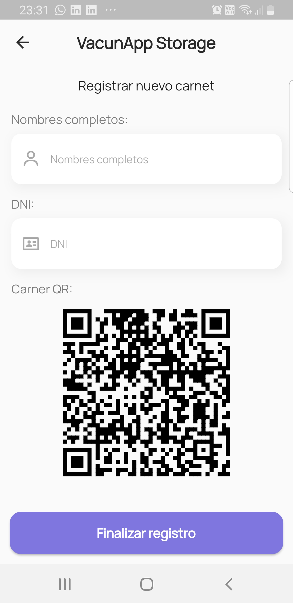
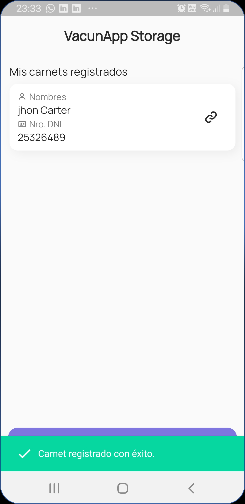
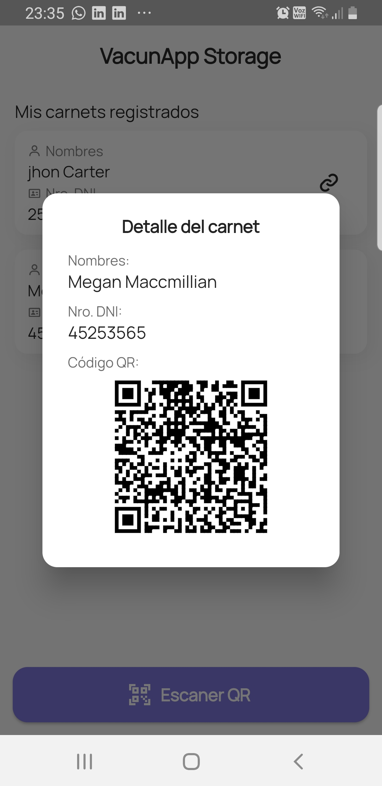

# flutter_codigo5_sqflite_qr

A new Flutter project.

## ScreenShot:

Intro Page:

ChatPage: 
 

Intro Homepage without Data: Is a conditional widget

ChatPage: 
 

Intro Page with data:

ChatPage: 
 

Intro Page QR Page:

ChatPage: 
 

ScannerQRpage with active botton: 
ChatPage: 
 

Intro Register Page:

ChatPage: 
 

ScannerQRpage SnacBar check save data:

ChatPage: 
 

Home Page, alert dialog for details :

ChatPage: 
 

## Getting Started

This project is a starting point for a Flutter application.

A few resources to get you started if this is your first Flutter project:

- [Lab: Write your first Flutter app](https://flutter.dev/docs/get-started/codelab)
- [Cookbook: Useful Flutter samples](https://flutter.dev/docs/cookbook)

For help getting started with Flutter, view our
[online documentation](https://flutter.dev/docs), which offers tutorials,
samples, guidance on mobile development, and a full API reference.
